# 🎞MYMOVIE
<br/>
<p align='center'>
  
</p>
<br/>

## 📽 소개
### 원하는 영화를 찾아 정보를 확인해보세요
영화 데이터베이스 ([TMDB](https://developers.themoviedb.org/3/getting-started/introduction)) API를 활용해서 만든 react 프로젝트입니다.
현재 상영중인 영화, 인기있는 영화, 평점이 좋은 영화를 확인할 수 있으며, 관심있는 영화를 저장할 수 있습니다. 또한 검색기능을 사용하여 원하는 영화를 찾아보며 상세정보를 확인할 수 있습니다.
<br/>

## ✨ Demo
### [Mymovie 웹 사이트 보러가기](https://sumzi.github.io/Mymovie/. "Mymovie")
<br/>

## 🧰 기능
* 반응형 웹 디자인
* API 사용하여 해당하는 영화정보 가져오기
* 무한 스크롤로 영화정보 받아오기
* 다크 모드 전환하기
* 관심있는 영화 추가, 삭제하기
* 검색으로 영화 찾기
<br/>

## 📁 프로젝트 구조
```
src
├─components  ────────────────  컴포넌트 관리
│  ├─About
│  ├─Card
│  ├─Footer
│  ├─Loading
│  └─Nav
├─images  ────────────────────  이미지 관리
├─pages ──────────────────────  react router 
│  ├─About
│  ├─Home
│  ├─Like
│  ├─Running
│  └─Search
├─store
│  ├─reducers ────────────────  각 page 별 action 상태 관리
│  └─sagas  ──────────────────  비동기 상태 관리
└─styles  ────────────────────  styled-components sytle
```
<br/>

## 💻 화면
|Home page||
|:---:|:---:|
|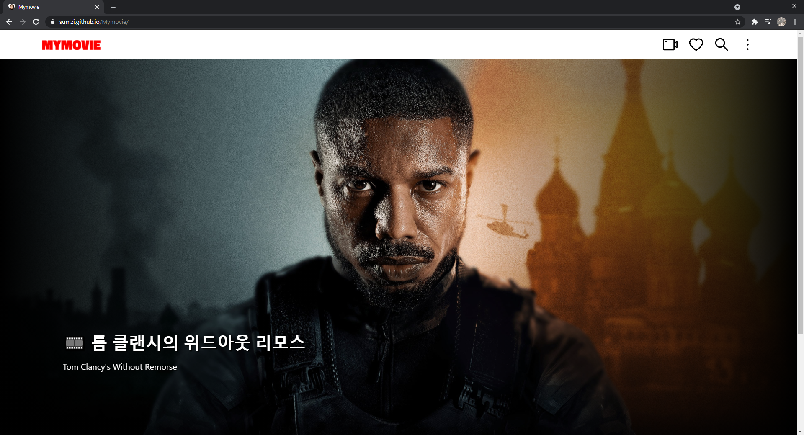||

24시간 하루동안 유행하는 상위 4개의 영화를 carousel로 볼 수 있습니다.
<br/>

|Running page||
|:---:|:---:|
|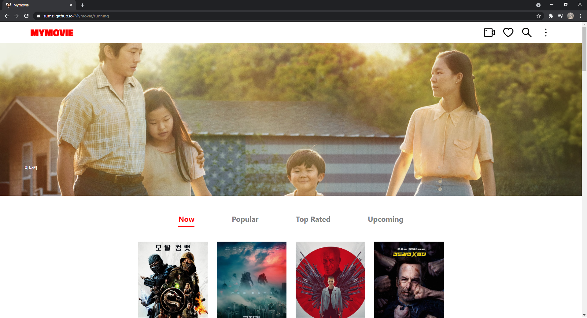|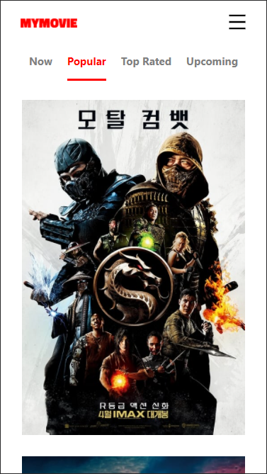|
|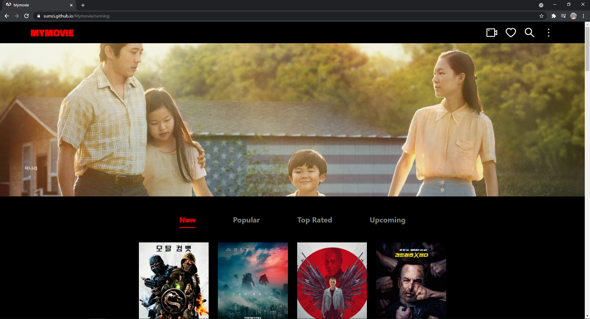|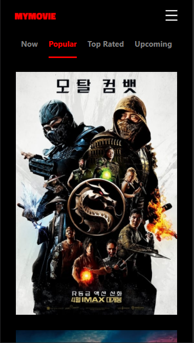|

현재 상영영화, 인기영화, 등급 높은 영화, 개봉예정 영화를 둘러볼 수 있습니다.
무한 스크롤을 이용해 스크롤이 일정 높이에 도달했을 때 영화 20개를 더 가져옵니다.
<br/>

|About page||
|:---:|:---:|
|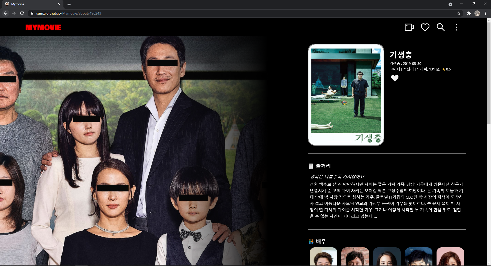|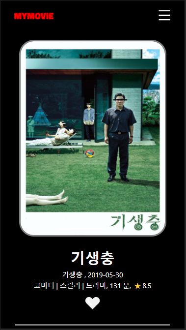|

영화의 정보, 줄거리, 배우, 이미지, 동영상을 볼 수 있으며 🤍이모티콘을 클릭하여 관심 있는 영화를 저장할 수 있습니다.
<br/>

|Like page||
|:---:|:---:|
|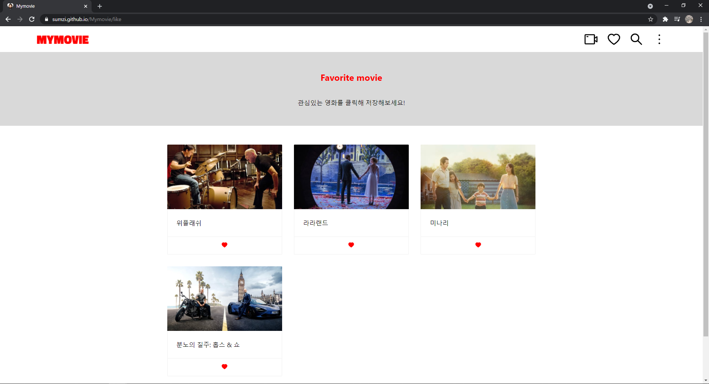|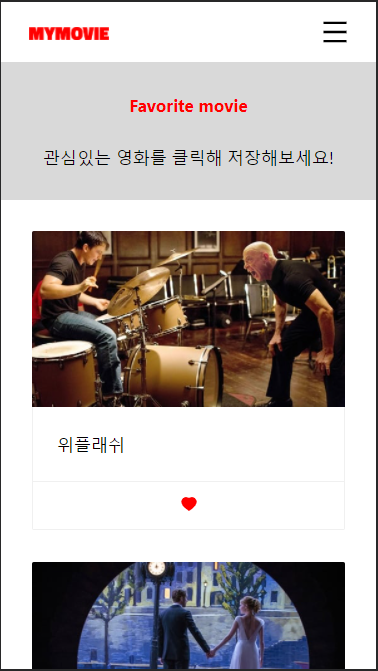|

관심 있는 영화의 상세정보를 볼 수 있으며, 삭제할 수 있습니다.
<br/>

|Search page||
|:---:|:---:|
|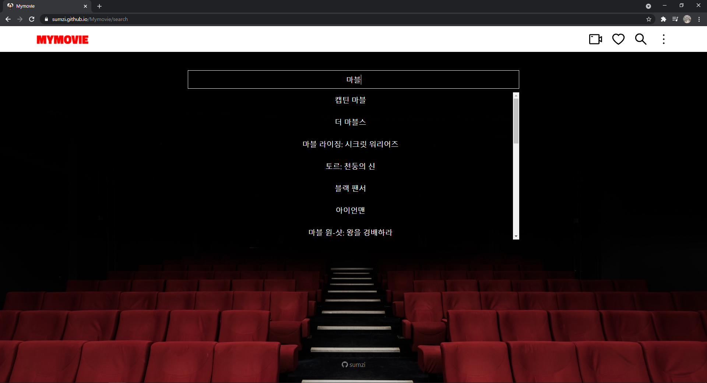|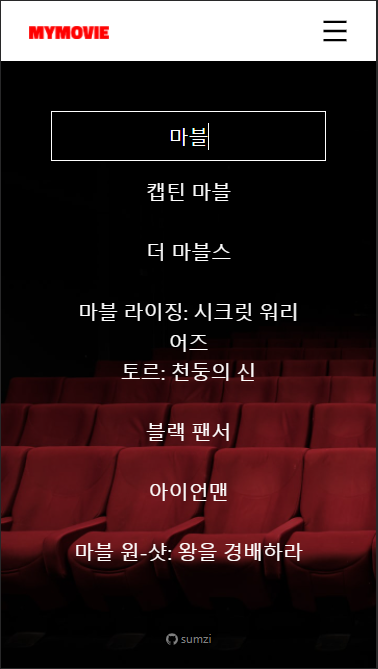|

직접 검색하여 원하는 영화를 찾을 수 있습니다.
<br/>

|light mode|dark mode|
|:---:|:---:|
|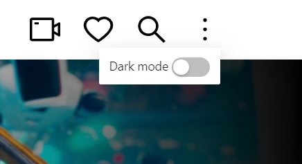|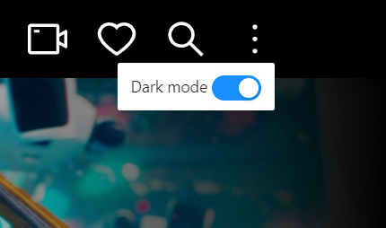|

원하는 모드로 설정할 수 있습니다.
<br/>

## 🛠️ 기술 스택
* react - 프로트 엔드 자바스크립트 라이브러리
* react-router - SPA 라우팅 라이브러리
* redux - 상태 관리 라이브러리
* redux-saga  - 비동기 상태 관리 라이브러리
* styled-components - 컴포넌트 스타일링 

<br/>

## 🤔 배운것
* 초기 계획이 매우 중요하다는 것을 알게 되었다... 확실하게 정하지 않고 프로젝트를 진행하니깐 수정하는데만 시간이 오래걸렸다. 
* Redux와 Redux-saga를 사용하여 비동기 상태 관리를 하는 방법
* styled-components props 값으로 설정값을 바꾸는 것
<br/>